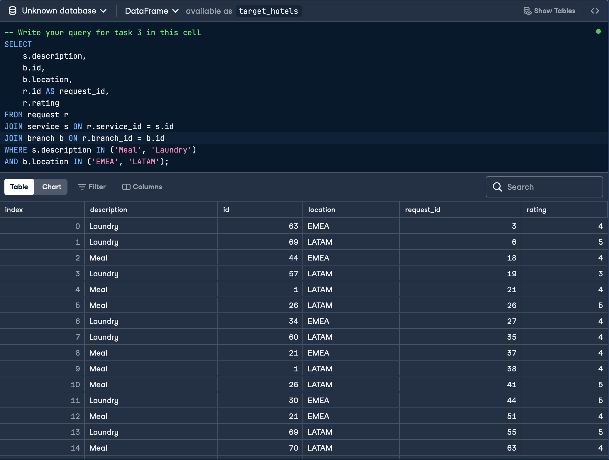
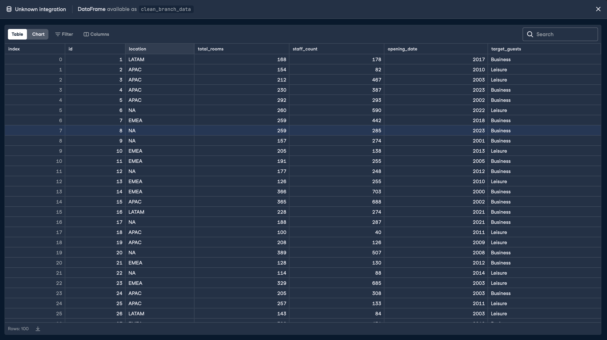
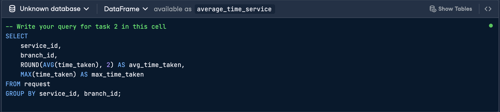
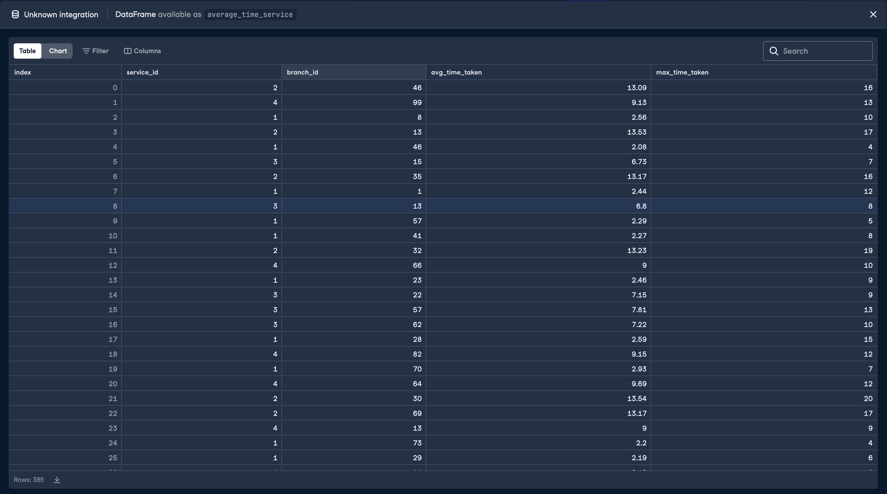
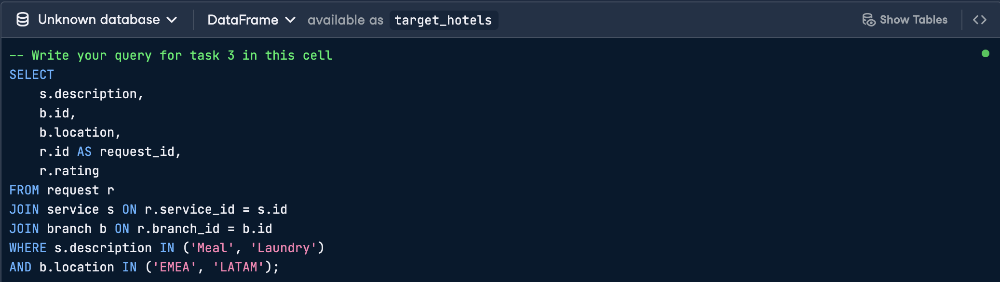
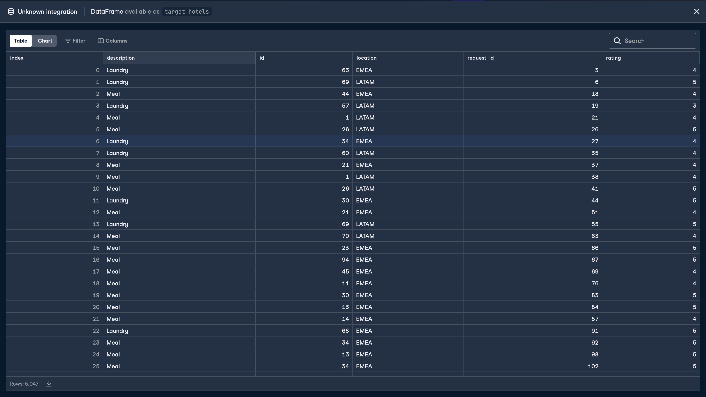
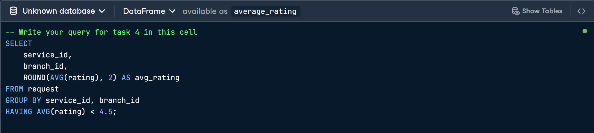
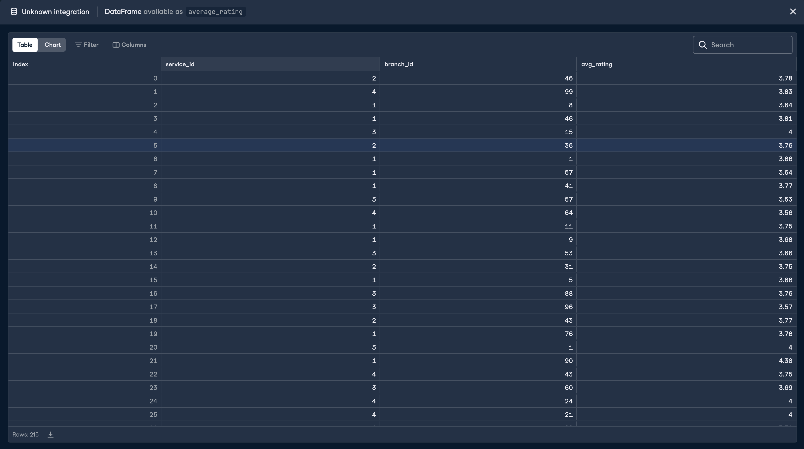

# Results

## Task 1 — Data Cleaning

**Code:**

**Output:**

---

## Task 2 — Service Performance by Branch

**Code:**

**Output:**

---

## Task 3 — Regional Service Analysis

**Code:**

**Output:**

---

## Task 4 — Underperforming Services

**Code:**

**Output:**

